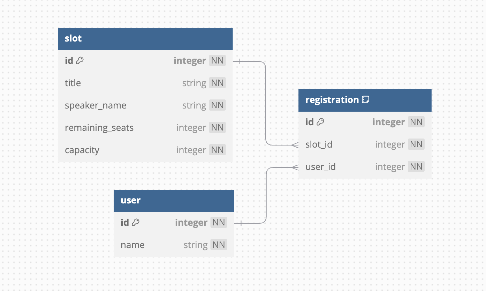

## 디렉토리 구조

---

```text
/src
  /api              (controller, dto)
  /application      (usecase)
  /domain           (service, interface, test)
  /infrastructure   (repository)
```

1. 설계의 단순함을 위해 기본적으로는 Layered Architecture 를 만족하도록,

    `Presentaion Layer` - api
    `Business Layer` - application, domain
    `Persistence Layer` - infrastructure

    의 형태로 디렉토리를 구성했습니다.
2. Clean Architecture 의 도메인 중심적인 구조와 항상 도메인으로 향하는 의존성 방향을 만족하기 위해 `Business Layer` 와 `Persistence Layer` 사이에 interface 와 implementation 를 구성했습니다. 이를 통해 `Business Layer` 에서 interface 를 정의하고 `Persistence Layer` 가 이를 의존하는 형태의 구성이 이루어지도록 했습니다.

## 데이터베이스 테이블 설계

---


1. `user` (사용자)
   - 사용자 정보를 저장하는 테이블입니다.
2. `slot` (특강)
   - 특강에 관한 정보를 저장하는 테이블입니다.
   - `capacity` 가 최대 정원, `remaining_seats` 가 잔여석입니다.
   - "특강 최대 정원"에 대한 동시성 제어를 위해 `remaining_seats` 컬럼을 추가했습니다.
3. `registratioin` (신청)
   - 사용자가 신청한 특강 정보를 저장하는 관계 테이블입니다.
   - "사용자의 중복 신청 방지"에 대한 동시성 제어를 위해 `slot_id` 와 `user_id` 의 조합으로 unique key index 를 추가했습니다.
